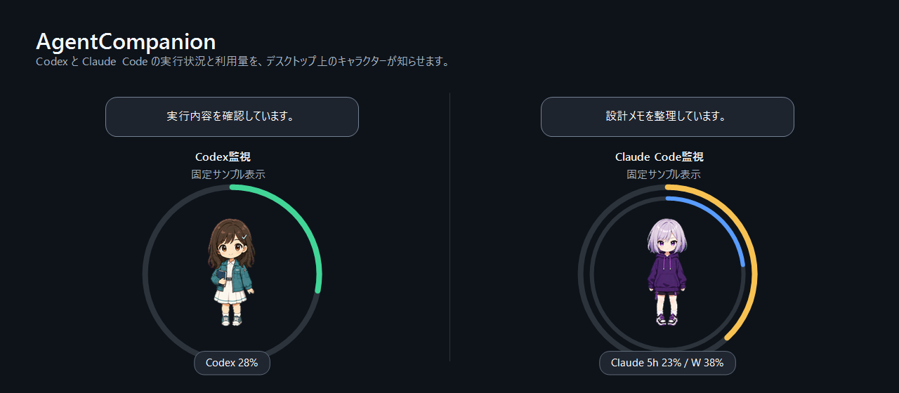
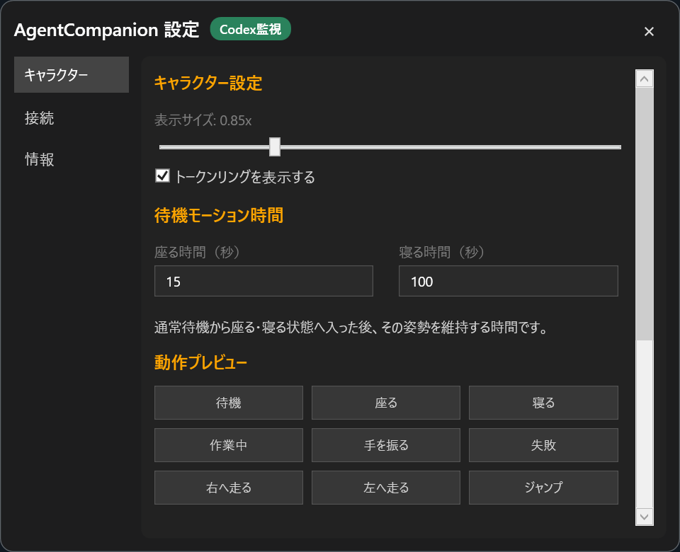
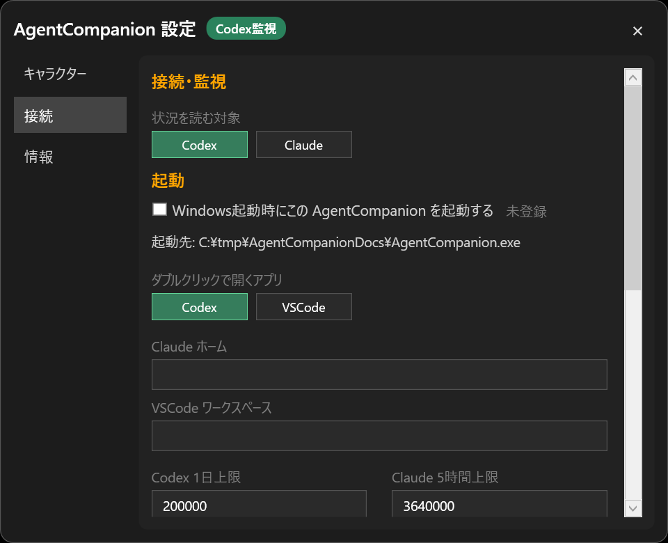

# AgentCompanion

[](https://github.com/k-hattori-itcs/agent-companion/releases/latest)
[](https://github.com/k-hattori-itcs/agent-companion/actions/workflows/build.yml)

AgentCompanion is a Windows desktop companion app that shows Codex / Claude activity and usage around a draggable desktop character.

It is a customized derivative of [sugar301/TokenPet](https://github.com/sugar301/TokenPet). AgentCompanion adds local Codex / Claude status monitoring, always-visible token rings, app launch/focus behavior, Japanese settings UI, and bundled Koharu / Luna / Natsuki characters.

## v1.1.0

- Adds `Claude Desk` as a double-click launch target. It starts Claude Desktop when needed and focuses it when already running.
- Resolves Claude Desk from the Windows Start Apps list at runtime, without relying on a device-specific app identifier.
- Refreshes expiring Claude Code OAuth credentials before usage requests, and retries a 401 response once after a successful refresh.
- Persists API `Retry-After` limits after a 429 response so restarting the app does not bypass the requested wait.
- Migrates existing Claude monitoring settings to retain the previous VSCode launch behavior on first load.

## UI Images

Public UI image generated from spritesheet-based character previews, with status bubbles and token rings:



Settings UI image for character appearance, animations, status monitoring, and startup:





## Features

- Shows the latest Codex task status in a bubble
- Shows the latest Claude Code session status in a bubble
- Displays usage with rings around the character
- Supports Claude short-window and weekly usage rings
- Switches character actions for working, completion, and error states
- Drag the character across monitors
- Double-click to open or focus Codex / VSCode
- Switch between Koharu, Luna, and Natsuki
- Tray menu for show/hide, settings, and exit
- Open Settings directly above the tray-menu selection on the selected monitor
- Preserve the character's physical screen position across hide/show on multi-monitor desktops
- Optional per-install Windows startup registration

## Requirements

- Windows 10 / 11
- The GitHub Actions artifact is self-contained and does not require a separate .NET Runtime install
- .NET 8 SDK for building from source

## Quick Start

```powershell
dotnet restore AgentCompanion.sln
dotnet publish AgentCompanion.csproj -c Release -r win-x64 --self-contained true -o .\publish\AgentCompanion
.\publish\AgentCompanion\AgentCompanion.exe
```

To publish with a specific default executable icon, pass `-p:AgentCompanionIcon=favicon-koharu.ico` or `-p:AgentCompanionIcon=favicon-luna.ico`. The character appearance and Codex / Claude status provider are still selected separately in the settings window.

## Multi-monitor behavior

When Settings is opened from the tray menu, the window is placed directly above the selected menu position and clamped to that monitor's work area. Physical pixel coordinates are used so mixed-DPI and negative-coordinate monitor layouts remain stable.

Opening Settings while the character is hidden does not show or move the character. Showing the character again restores its physical position from immediately before it was hidden. If that monitor has been disconnected, the position is corrected into the currently available desktop.

See [SETUP.md](./SETUP.md) for detailed Japanese setup instructions, including how to add character packages.

Natsuki is an energetic summer-themed companion covering the complete AgentCompanion action set.

### Character package format

For a v2 8x11 spritesheet, set spriteVersionNumber: 2 and supply a 1536x2288 image with 192x208 cells in an 8-column, 11-row grid. When spritesheetLayout is included, it must declare the same dimensions and lookDirectionCount: 16. Rows 0-8 are the nine standard animations played by the app; rows 9-10 are retained as look-direction data for future use.

## Claude Monitoring Limitations

Claude monitoring targets local history written by Claude Code CLI, including sessions launched from the VSCode integrated terminal. AgentCompanion reads `projects/**/*.jsonl` for activity status. Exact five-hour and weekly utilization from Anthropic is requested only after the user explicitly enables the Claude Code OAuth usage API setting. Successful API refreshes run every 15 minutes; ordinary failures retry after five minutes, while 429 responses honor `Retry-After` across restarts.

Limitations:

- It does not directly monitor Claude Web, Claude Desktop, or VSCode extension-only UI state.
- If Claude Code CLI does not write local JSONL history, the status bubble will not update.
- Usage priority is: the Claude Code OAuth usage response when explicitly enabled, Claude Code statusline cache (`agentcompanion-rate-limits.json`, with the legacy `agentpet-rate-limits.json` accepted during migration), then local-history estimates. Estimated labels include `~`. The OAuth usage endpoint is not a documented public API and may change; AgentCompanion automatically falls back when it is unavailable.
- Set `Claude Home` and `VSCode Workspace` explicitly when they differ from the defaults.

## Privacy and local data

AgentCompanion sends no product telemetry and does not call an external LLM to summarize activity. Codex monitoring reads `%USERPROFILE%/.codex/sessions/**/rollout-*.jsonl`. Claude monitoring reads local Claude Code history. Only when the user explicitly enables the Claude Code OAuth usage API setting does it read the OAuth credential and send a read-only authenticated GET request to `https://api.anthropic.com/api/oauth/usage`. AgentCompanion never copies OAuth tokens into its own configuration, display, or logs. When a refresh succeeds, it atomically updates the shared Claude Code `.credentials.json` entry so rotated credentials remain usable by Claude Code.

Settings, token history, proxy targets, character packages, and logs stay under `%LOCALAPPDATA%/AgentCompanion/instances/<instance-id>`. Imported character packages are preserved by normal updates made in the same installation folder. The instance ID is derived from the executable folder path, so installing in a different folder creates an independent profile and does not migrate imported characters automatically. `agentcompanion.log` is capped and rotated at 1 MB. `debug.log` is written only when proxy debug logging is explicitly enabled and is rotated at 2 MB.

The optional API proxy listens only on `127.0.0.1`. It forwards the caller's Authorization header to the validated upstream TLS endpoint but does not persist API keys or request/response bodies. Unknown prefixes fail closed instead of falling back to another target. The proxy is limited to Content-Length based OpenAI-compatible JSON APIs; Transfer-Encoding and HTTP pipelining requests are rejected.
## License

MIT License.

AgentCompanion is derived from TokenPet by sugar301. See [LICENSE](./LICENSE), [NOTICE](./NOTICE), and [THIRD_PARTY_NOTICES.md](./THIRD_PARTY_NOTICES.md). The internal namespace is `AgentCompanion`, while the upstream TokenPet attribution remains in the license documents.
